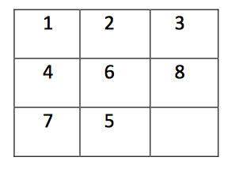
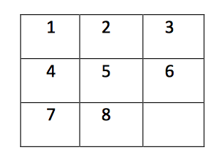
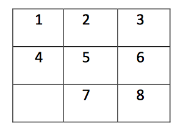

# Solving-Puzzle-With-Dijkstras-Algorithm
In this project we try to solve a puzzle using the Dijkstra's algorithm. A brief explanation of the problem is given below. 

## Overview of problem 
The game consists of a 3x3 grid with 8 tiles numbered 1 to 8. There is one gap in the puzzle that allows movement of tiles. Tiles can move horizontally or vertically. Here may be one starting configuration of an 8-puzzle:

We use the word “state” to refer to each configuration of the puzzle. We can call the configuration above as the “start state”. Typically, our goal is to reach this configuration (goal state):

One possible solution to reach the target in this example is by moving 8 down, 6 right, 5 up and then 8 left. However moving every digit has some cost associated with it. Our goal is to reach the goal with minimum costs. 

## Methodology 

We consider every single state as a node. As we move the digits inside this node the state gets changed. Also as we move digits we incur some cost. This new state is another node and the initial state is also another node. So we move between two nodes with some cost. These two nodes form a graph. As we keep on changing states we keep on forming new nodes with edges and costs. Hence we ultimately span an entire graph, if we consider all the possibilities. 

Once we have this graph then we know that there is one source node, which is the initial state and other destination node which is the final state. Between these two we trace out a path using the Dijkstra's algorithm. The time complexity for solving the game of any difficulty would be O(|V||E|) where |V| and |E| are number of nodes and edges respectively. In our case there would be a total of 1,80,000 states which can be practically achieved out of the 9! possible states, and the number of edges would be 5,40,000. Hence we can assume that the time complexity would be O((|E|)^2). 

## File format 

+ **Input File** The input filename will be given as a system argument when the code is run. The first line of the input file should consist of an integer T denoting the number of testcases in the file.The first line of each test case should consist of two space separated strings representing the start state and the goal state. The second line of a test case should consist of 8 non-negative integers, d1 ... d8 representing the cost function (0 <= di <= 1000).

A sample input file is as follows: 

4

12346875G 12345678G 

1 2 3 4 5 6 7 8

12346875G 123456G78 

0 0 0 0 0 0 0 0 

12346875G 1b2346875G

1 2 3 4 4 3 2 1 

12346875G 12346857G

1 2 3 4 5 6 7 8 

+ **Output File** The code will generate an ouptut file in a .txt format, the name of the file that you wish to have shuld be given as a system argument during runtime. For each test case, there will be two lines. In the first line there will be two integers 'n', the number of moves in the optimal path to reach the goal state from the start state, and 'd', the cost of the optimal path. If goal state is not reachable then output would be “-1 -1”. In the next line, if a path exists, then there will be n space separated tokens to describe the moves the optimal path. Each token consists of an integer from 1 to 8 and a character in {U, D, L, R} which describes which number was moved in the position of the gap, and the direction it moved. 

For example, suppose the code computes solution “8 down, 6 right, 5 up, 8 left” (4 moves, cost 27) for first test case and “8 down, 6 right, 5 up, 7 right” (4 moves, cost 0) for the second test case (and so on), following will be the output file. If the path is of length 0, or it doesn’t exist, then this line will be left as blank. 

4 27

8D 6R 5U 8L 

4 0

8D 6R 5U 7R

0 0

<blank line> 
  
  -1 -1
  
<blank line>

## How to run
Compile using `javac Puzzle.java`

Run using `java Puzzle.java someInputFileName.txt someOutputFileName.txt`

## Author 

+ [Vipul Khatana](https://github.com/vipul-khatana)

Course Project under [**Prof Mausam**](http://www.cse.iitd.ac.in/~mausam/)

## Contributing 

1) Fork it (https://github.com/vipul-khatana/Solving-Puzzle-with-Dijkstras-Algorithm/fork)
2) Create your feature branch git checkout -b feature/fooBar
3) Commit your changes git commit -am 'Add some fooBar'
4) Push to the branch git push origin feature/fooBar
5) Create a new pull request

